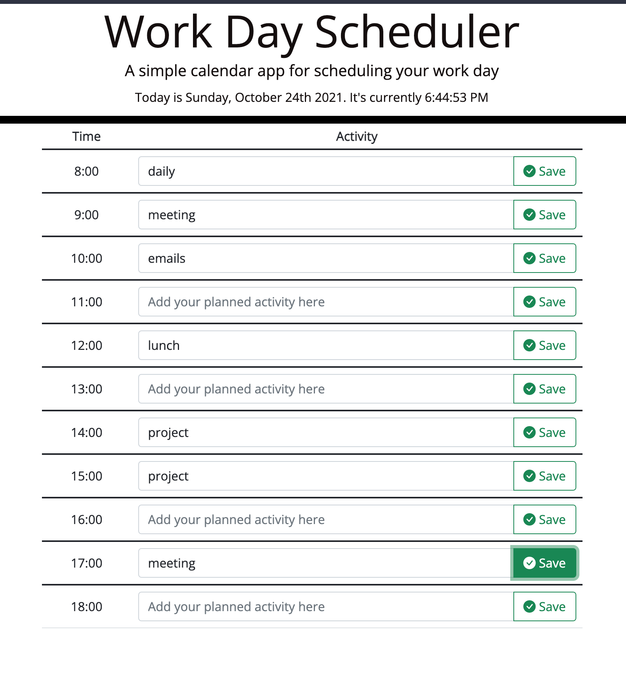
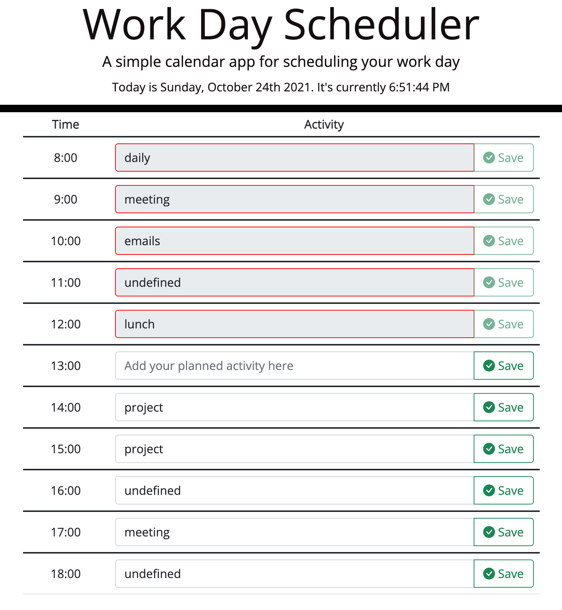

# Week 5 Homework: Workday Scheduler App

## Links
* https://nnassarv.github.io/homework-week-5/
* https://github.com/nnassarv/homework-week-5

## Description of the App
For this week's homework I created a "work scheduler" app. This app allows the user to define and plan the work to be done during 60 minute time blocks. The time blocks begin at 8:00 and go until 18:00.

### Saving in local storage
Once the user has added an activity for a particular time block, the user must then click on the "save" button on the right side and this will save the text added into the input field into the local storage. 

If the user refreshes or closes the app, the activities previously saved will persist and be displayed in the corresponding time block. 

### Differentiate time blocks in the past
The app also keeps track of the current time. Not only is the current date and time shown at the top of the screen, but it is also used to keep track of which time blocks are in the past. 

If the app recognizes that the current time is later that the time block, the time block will be disabled (read-only mode), the save button will be greyed out and disabled, and the border of the input field will be shown in red color.

## Technology Used
I used the following languages/libraries to define the UI and display of the app:
* HTML
* CSS
* Bootstrap
* Bootstrap Icons (instead of Font Awesome)
* Google Fonts

I used the following languages/libraries to define the logic and behaviours of the app:
* JavaScript
* jQuery
* MomentJS

## Screenshots
* In the following screenshot we can see how the app shows icons and fields when a new activity is added:

* In the following screen, we can see how the app displays the time blocks in the past (disabled and with different design) compared to the available or upcoming time blocks
